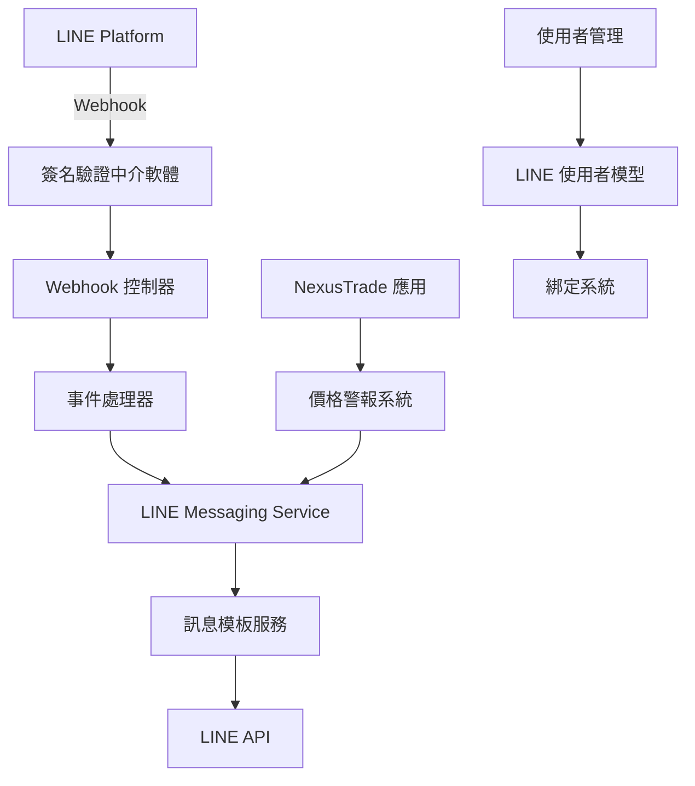

# LINE Messaging API 模組完整開發指南

## 📋 目錄

1. [概述](#概述)
2. [系統架構](#系統架構)
3. [快速開始](#快速開始)
4. [LINE 開發者設定](#line-開發者設定)
5. [伺服器配置](#伺服器配置)
6. [API 端點文件](#api-端點文件)
7. [Webhook 事件處理](#webhook-事件處理)
8. [訊息模板系統](#訊息模板系統)
9. [使用者綁定系統](#使用者綁定系統)
10. [測試指南](#測試指南)
11. [部署說明](#部署說明)
12. [故障排除](#故障排除)
13. [最佳實踐](#最佳實踐)

---

## 概述

本模組為 NexusTrade 平台提供完整的 LINE Messaging API 整合，包含：

### ✨ 核心功能
- **Webhook 事件處理** - 接收並處理來自 LINE Platform 的各種事件
- **訊息推送** - 主動發送通知給使用者
- **Flex Message** - 豐富的視覺化訊息模板
- **Rich Menu** - 互動式選單設計
- **使用者綁定** - LINE 帳號與 NexusTrade 帳號整合
- **價格警報** - 即時價格通知推送

### 🎯 應用場景
- 加密貨幣價格警報通知
- 市場趨勢分析推送
- AI 分析結果分享
- 使用者互動和客服
- 系統狀態通知

---

## 系統架構

### 🏗️ 模組結構

```
src/
├── services/
│   ├── line-messaging.service.js           # 核心 LINE API 服務
│   └── line-message-templates.service.js   # 訊息模板管理
├── controllers/
│   └── line-webhook.controller.js          # Webhook 事件控制器
├── middleware/
│   └── line-signature.middleware.js        # 簽名驗證中介軟體
├── models/
│   └── LineUser.js                         # LINE 使用者資料模型
└── routes/
    └── line.js                             # LINE API 路由
```

### 📊 數據流程



---

## 快速開始

### 1. 安裝依賴套件

```bash
# 已在 NexusTrade 專案中包含
npm install axios crypto express
```

### 2. 環境變數設定

在 `.env` 檔案中添加 LINE 相關設定：

```bash
# LINE OAuth 設定
LINE_CHANNEL_ID=your_line_channel_id
LINE_CHANNEL_SECRET=your_line_channel_secret
LINE_CALLBACK_URL=http://localhost:3000/auth/line/callback

# LINE Messaging API 設定
LINE_ACCESS_TOKEN=your_line_messaging_access_token
LINE_MESSAGING_CHANNEL_ACCESS_TOKEN=your_line_messaging_access_token
LINE_MESSAGING_CHANNEL_SECRET=your_line_channel_secret
LINE_MESSAGING_WEBHOOK_URL=http://localhost:3000/api/line/webhook

# LINE Bot 設定
LINE_BOT_NAME=NexusTrade Bot
LINE_BOT_DESCRIPTION=NexusTrade 加密貨幣交易通知機器人
LINE_RICH_MENU_ENABLED=true
```

### 3. 啟動服務

```bash
npm start
```

### 4. 驗證服務狀態

```bash
curl http://localhost:3000/api/line/status
```

預期回應：
```json
{
  "success": true,
  "data": {
    "service": "line-messaging",
    "configured": true,
    "endpoints": {
      "webhook": "/api/line/webhook",
      "push": "/api/line/push",
      "bind": "/api/line/bind"
    },
    "features": {
      "pushMessage": true,
      "flexMessage": true,
      "richMenu": true,
      "webhook": true
    }
  }
}
```

---

## LINE 開發者設定

### 🔧 建立 LINE 開發者帳號

1. **註冊 LINE Developers**
   - 前往 [LINE Developers Console](https://developers.line.biz/)
   - 使用 LINE 帳號登入
   - 建立新的 Provider

2. **建立 Messaging API Channel**
   ```
   Channel Type: Messaging API
   Channel Name: NexusTrade Bot
   Channel Description: 加密貨幣交易通知機器人
   Category: 金融 / Finance
   Subcategory: 投資 / Investment
   ```

3. **取得必要憑證**
   - **Channel ID**: 在 Basic Settings 頁面
   - **Channel Secret**: 在 Basic Settings 頁面
   - **Channel Access Token**: 在 Messaging API 頁面生成

### ⚙️ Webhook 設定

1. **設定 Webhook URL**
   ```
   Webhook URL: https://your-domain.com/api/line/webhook
   或開發環境: https://your-ngrok-url.ngrok.io/api/line/webhook
   ```

2. **啟用 Webhook**
   - 在 Messaging API 設定頁面
   - 開啟 "Use webhook"
   - 設定 Webhook URL
   - 點擊 "Verify" 驗證連接

3. **關閉自動回應**
   ```
   Auto-reply messages: 停用
   Greeting messages: 停用
   ```

4. **測試 Webhook**
   ```bash
   # 使用 ngrok 建立公開 URL (開發環境)
   ngrok http 3000
   
   # 複製 HTTPS URL 到 LINE Console
   # 例如：https://abc123.ngrok.io/api/line/webhook
   ```

---

## 伺服器配置

### 📝 路由配置

路由已自動整合到 `src/server.js`：

```javascript
// 路由設定
app.use('/health', healthRouter);
app.use('/auth', authRouter);
app.use('/api', apiRouter);
app.use('/api/line', lineRouter);  // LINE API 路由
```

### 🔒 安全性設定

1. **簽名驗證**
   - 所有 Webhook 請求都經過簽名驗證
   - 使用 HMAC-SHA256 確保請求來源可信

2. **HTTPS 要求**
   - 生產環境必須使用 HTTPS
   - LINE Platform 只接受 HTTPS Webhook URL

3. **存取控制**
   - 推送 API 需要 JWT 認證
   - 管理功能限制管理員權限

---

## API 端點文件

### 📡 Webhook 端點

#### POST `/api/line/webhook`
接收 LINE Platform 的 Webhook 事件

**Headers:**
```
X-Line-Signature: {signature}
Content-Type: application/json
```

**Request Body:**
```json
{
  "events": [
    {
      "type": "message",
      "replyToken": "reply_token_here",
      "source": {
        "type": "user",
        "userId": "user_id_here"
      },
      "message": {
        "type": "text",
        "text": "Hello"
      },
      "timestamp": 1625097600000
    }
  ]
}
```

**Response:**
```json
{
  "success": true,
  "processed": 1,
  "results": [
    {
      "eventType": "message",
      "success": true,
      "result": {
        "action": "text_message_handled"
      }
    }
  ]
}
```

### 💬 訊息推送端點

#### POST `/api/line/push`
推送訊息給指定使用者

**Headers:**
```
Authorization: Bearer {jwt_token}
Content-Type: application/json
```

**Request Body:**
```json
{
  "userId": "line_user_id",
  "message": "Hello from NexusTrade!",
  "messageType": "text"
}
```

**Response:**
```json
{
  "success": true,
  "data": {
    "success": true,
    "messageId": "message_id_here",
    "timestamp": "2025-06-23T01:00:00.000Z"
  }
}
```

#### POST `/api/line/push/price-alert`
推送價格警報訊息

**Request Body:**
```json
{
  "userId": "line_user_id",
  "alertData": {
    "symbol": "BTCUSDT",
    "currentPrice": "102000.50",
    "targetPrice": "100000.00",
    "changePercent": 2.0,
    "alertType": "above"
  }
}
```

#### POST `/api/line/push/market-update`
推送市場更新訊息

**Request Body:**
```json
{
  "userIds": ["user1", "user2"],
  "marketData": {
    "trending": [
      {
        "symbol": "BTC",
        "price": "102000.50",
        "change": 2.5
      }
    ],
    "summary": "市場保持上漲趨勢",
    "timestamp": "2025-06-23T01:00:00.000Z"
  }
}
```

### 🔗 使用者綁定端點

#### POST `/api/line/bind`
綁定 LINE 帳號到 NexusTrade 使用者

**Headers:**
```
Authorization: Bearer {jwt_token}
```

**Request Body:**
```json
{
  "lineUserId": "line_user_id_here"
}
```

#### GET `/api/line/bind/status`
檢查綁定狀態

**Response:**
```json
{
  "success": true,
  "data": {
    "userId": "nexus_user_id",
    "isBound": true,
    "lineUserId": "line_use...",
    "bindTime": "2025-06-23T01:00:00.000Z",
    "lastActivity": "2025-06-23T01:30:00.000Z"
  }
}
```

#### DELETE `/api/line/bind`
解除 LINE 帳號綁定

### 📊 狀態和模板端點

#### GET `/api/line/status`
檢查 LINE 服務狀態（公開端點）

#### GET `/api/line/templates`
取得可用訊息模板列表

**Response:**
```json
{
  "success": true,
  "data": {
    "templates": [
      {
        "id": "price_alert",
        "name": "價格警報",
        "description": "加密貨幣價格達到設定條件時的通知",
        "type": "flex",
        "parameters": ["symbol", "currentPrice", "targetPrice", "alertType", "changePercent"]
      }
    ],
    "totalCount": 4
  }
}
```

---

## Webhook 事件處理

### 📨 支援的事件類型

#### 1. 訊息事件 (message)
使用者發送訊息時觸發

**支援的訊息類型:**
- `text` - 文字訊息
- `image` - 圖片訊息
- `sticker` - 貼圖訊息

**指令處理:**
```javascript
// 自動識別的指令
'幫助', 'help' → 顯示功能說明
'價格', 'price' → 顯示熱門加密貨幣價格
'BTC', 'ETH' → 顯示特定加密貨幣價格
'狀態', 'status' → 顯示系統狀態
'警報', 'alert' → 警報設定說明
```

#### 2. 關注事件 (follow)
使用者加為好友時觸發

**自動行為:**
- 取得使用者基本資料
- 發送歡迎 Flex Message
- 記錄新使用者

#### 3. 取消關注事件 (unfollow)
使用者封鎖或刪除機器人時觸發

**自動行為:**
- 停用該使用者的所有通知
- 更新使用者狀態為非活躍

#### 4. Postback 事件 (postback)
使用者點擊 Rich Menu 或互動按鈕時觸發

**支援的 Postback 動作:**
```json
{
  "type": "price_check",
  "symbol": "BTC"
}
{
  "type": "market_summary"
}
{
  "type": "settings"
}
{
  "type": "help"
}
```

### 🔧 自訂事件處理器

在 `src/controllers/line-webhook.controller.js` 中新增自訂處理邏輯：

```javascript
// 處理自訂文字指令
handleTextMessage(replyToken, text, userId) {
  const lowerText = text.toLowerCase();
  
  // 新增自訂指令
  if (lowerText.includes('portfolio')) {
    return this.sendPortfolioInfo(replyToken, userId);
  }
  
  // 呼叫現有的處理邏輯
  return this.handleDefaultTextMessage(replyToken, text, userId);
}

// 新增自訂回應方法
async sendPortfolioInfo(replyToken, userId) {
  // 實作投資組合資訊回應
  const portfolioText = "您的投資組合功能正在開發中...";
  await lineMessagingService.replyMessage(replyToken, portfolioText);
  return { action: 'portfolio_info_sent' };
}
```

---

## 訊息模板系統

### 🎨 模板類型

#### 1. 文字訊息模板
```javascript
const messageTemplates = require('../services/line-message-templates.service');

// 歡迎訊息
const welcomeText = messageTemplates.templates.text.welcome({
  username: 'John'
});

// 幫助訊息
const helpText = messageTemplates.templates.text.help();

// 錯誤訊息
const errorText = messageTemplates.templates.text.error({
  type: 'network',
  details: '連線逾時'
});
```

#### 2. Flex Message 模板
```javascript
// 價格警報 Flex Message
const priceAlertFlex = messageTemplates.templates.flex.priceAlert({
  symbol: 'BTCUSDT',
  currentPrice: '102000.50',
  targetPrice: '100000.00',
  changePercent: 2.0,
  alertType: 'above'
});

// 市場摘要 Flex Message
const marketSummaryFlex = messageTemplates.templates.flex.marketSummary({
  trending: [
    { symbol: 'BTC', price: '102000.50', change: 2.5 },
    { symbol: 'ETH', price: '3800.25', change: -1.2 }
  ],
  marketSentiment: {
    summary: '市場保持上漲趨勢'
  }
});
```

#### 3. Quick Reply 模板
```javascript
// 主選單 Quick Reply
const mainMenuQuickReply = messageTemplates.templates.quickReply.mainMenu();

// 加密貨幣選擇 Quick Reply
const cryptoSelectQuickReply = messageTemplates.templates.quickReply.cryptoSelect();
```

### 🛠️ 自訂模板

在 `src/services/line-message-templates.service.js` 中新增自訂模板：

```javascript
// 新增投資組合模板
createPortfolioFlex(portfolioData) {
  return {
    type: 'bubble',
    header: {
      type: 'box',
      layout: 'vertical',
      contents: [{
        type: 'text',
        text: '💼 我的投資組合',
        weight: 'bold',
        color: '#FFFFFF',
        size: 'md'
      }],
      backgroundColor: '#1DB446'
    },
    body: {
      type: 'box',
      layout: 'vertical',
      contents: [
        // 投資組合內容
      ]
    }
  };
}

// 註冊新模板
this.templates.flex.portfolio = this.createPortfolioFlex;
```

---

## 使用者綁定系統

### 👤 使用者資料模型

```javascript
const { LineUser, lineUserService } = require('../models/LineUser');

// 建立新使用者
const user = await lineUserService.create({
  lineUserId: 'line_user_id',
  displayName: 'John Doe',
  language: 'zh-TW'
});

// 綁定到 NexusTrade 帳號
await lineUserService.bind(
  'line_user_id',
  'nexus_trade_user_id',
  { email: 'john@example.com' }
);

// 查詢使用者
const user = await lineUserService.findByLineUserId('line_user_id');
const boundUser = await lineUserService.findByNexusTradeUserId('nexus_user_id');
```

### ⚙️ 通知設定管理

```javascript
// 更新通知設定
user.updateNotificationSettings({
  priceAlerts: true,
  marketUpdates: false,
  aiAnalysis: true,
  dailySummary: true
});

// 檢查是否應該接收通知
if (user.shouldReceiveNotification('priceAlerts')) {
  // 發送價格警報
  await lineMessagingService.pushMessage(user.lineUserId, alertMessage);
}

// 檢查安靜時間
if (!user.isInQuietHours()) {
  // 非安靜時間，可以發送通知
}
```

### 📊 使用者統計

```javascript
// 記錄使用者活動
user.recordActivity('command', { command: 'price' });

// 記錄通知發送
user.recordNotification('price_alert');

// 取得使用者摘要
const summary = user.getSummary();
console.log(summary);
// {
//   lineUserId: "line_use...",
//   displayName: "John Doe",
//   isBound: true,
//   totalMessages: 15,
//   totalNotifications: 8
// }
```

---

## 測試指南

### 🧪 單元測試

建立測試檔案 `tests/line-messaging.test.js`：

```javascript
const request = require('supertest');
const app = require('../src/server');

describe('LINE Messaging API', () => {
  test('GET /api/line/status should return service status', async () => {
    const response = await request(app)
      .get('/api/line/status')
      .expect(200);
      
    expect(response.body.success).toBe(true);
    expect(response.body.data.service).toBe('line-messaging');
  });

  test('POST /api/line/webhook should handle valid webhook', async () => {
    const webhookData = {
      events: [
        {
          type: 'message',
          replyToken: 'test_reply_token',
          source: { userId: 'test_user_id' },
          message: { type: 'text', text: 'hello' }
        }
      ]
    };

    const response = await request(app)
      .post('/api/line/webhook')
      .send(webhookData)
      .expect(200);
      
    expect(response.body.success).toBe(true);
  });
});
```

執行測試：
```bash
npm test
```

### 🔧 開發測試工具

#### 1. Webhook 測試工具
建立 `tools/test-webhook.js`：

```javascript
const axios = require('axios');

async function testWebhook() {
  const testEvent = {
    events: [
      {
        type: 'message',
        replyToken: 'test_reply_token',
        source: { userId: 'test_user_id' },
        message: { type: 'text', text: '幫助' },
        timestamp: Date.now()
      }
    ]
  };

  try {
    const response = await axios.post(
      'http://localhost:3000/api/line/webhook',
      testEvent,
      {
        headers: {
          'Content-Type': 'application/json',
          'X-Line-Signature': 'test_signature'
        }
      }
    );
    
    console.log('Webhook 測試成功:', response.data);
  } catch (error) {
    console.error('Webhook 測試失敗:', error.response?.data || error.message);
  }
}

testWebhook();
```

#### 2. 訊息推送測試
建立 `tools/test-push.js`：

```javascript
const axios = require('axios');

async function testPushMessage() {
  try {
    const response = await axios.post(
      'http://localhost:3000/api/line/push',
      {
        userId: 'test_line_user_id',
        message: 'Hello from NexusTrade!',
        messageType: 'text'
      },
      {
        headers: {
          'Authorization': 'Bearer your_jwt_token',
          'Content-Type': 'application/json'
        }
      }
    );
    
    console.log('推送測試成功:', response.data);
  } catch (error) {
    console.error('推送測試失敗:', error.response?.data || error.message);
  }
}

testPushMessage();
```

### 📱 LINE App 測試

1. **加為好友測試**
   - 在 LINE Developers Console 取得 QR Code
   - 用手機 LINE App 掃描加為好友
   - 測試歡迎訊息是否正確顯示

2. **指令測試**
   ```
   發送訊息: "幫助"
   預期回應: 顯示功能說明

   發送訊息: "價格"
   預期回應: 顯示價格查詢說明

   發送訊息: "BTC"
   預期回應: 顯示 BTC 價格資訊
   ```

3. **Flex Message 測試**
   - 測試價格警報 Flex Message 顯示
   - 測試市場摘要 Flex Message 顯示
   - 確認按鈕和連結正常運作

---

## 部署說明

### 🚀 生產環境部署

#### 1. 環境準備
```bash
# 安裝 PM2 (如果尚未安裝)
npm install -g pm2

# 建立生產環境設定檔
cp .env.example .env.production
```

#### 2. 環境變數設定
```bash
# .env.production
NODE_ENV=production
PORT=3000

# LINE 生產環境憑證
LINE_CHANNEL_ID=your_production_channel_id
LINE_CHANNEL_SECRET=your_production_channel_secret
LINE_ACCESS_TOKEN=your_production_access_token
LINE_MESSAGING_WEBHOOK_URL=https://your-domain.com/api/line/webhook

# 其他生產環境設定
MONGODB_URI=mongodb://your-production-db/nexustrade
JWT_SECRET=your_production_jwt_secret
```

#### 3. 部署腳本
建立 `scripts/deploy.sh`：

```bash
#!/bin/bash

echo "🚀 部署 NexusTrade 到生產環境..."

# 停止現有服務
pm2 stop nexustrade-api || true

# 更新程式碼
git pull origin main

# 安裝依賴
npm ci --production

# 資料庫遷移 (如需要)
# npm run migrate

# 啟動服務
pm2 start ecosystem.config.js --env production

# 檢查服務狀態
pm2 status

echo "✅ 部署完成！"
```

#### 4. PM2 設定
建立 `ecosystem.config.js`：

```javascript
module.exports = {
  apps: [
    {
      name: 'nexustrade-api',
      script: 'src/server.js',
      instances: 'max',
      exec_mode: 'cluster',
      env: {
        NODE_ENV: 'development',
        PORT: 3000
      },
      env_production: {
        NODE_ENV: 'production',
        PORT: 3000
      },
      log_file: 'logs/combined.log',
      out_file: 'logs/out.log',
      error_file: 'logs/error.log',
      log_date_format: 'YYYY-MM-DD HH:mm:ss Z',
      merge_logs: true
    }
  ]
};
```

### 🔒 HTTPS 設定

#### 1. 使用 Nginx 反向代理
建立 `/etc/nginx/sites-available/nexustrade`：

```nginx
server {
    listen 80;
    server_name your-domain.com;
    return 301 https://$server_name$request_uri;
}

server {
    listen 443 ssl http2;
    server_name your-domain.com;

    ssl_certificate /path/to/your/cert.pem;
    ssl_certificate_key /path/to/your/key.pem;

    location / {
        proxy_pass http://localhost:3000;
        proxy_http_version 1.1;
        proxy_set_header Upgrade $http_upgrade;
        proxy_set_header Connection 'upgrade';
        proxy_set_header Host $host;
        proxy_set_header X-Real-IP $remote_addr;
        proxy_set_header X-Forwarded-For $proxy_add_x_forwarded_for;
        proxy_set_header X-Forwarded-Proto $scheme;
        proxy_cache_bypass $http_upgrade;
    }

    # LINE Webhook 特別設定
    location /api/line/webhook {
        proxy_pass http://localhost:3000;
        proxy_set_header X-Real-IP $remote_addr;
        proxy_set_header X-Forwarded-For $proxy_add_x_forwarded_for;
        proxy_set_header X-Forwarded-Proto $scheme;
        
        # 確保原始請求內容保持完整
        proxy_buffering off;
        proxy_request_buffering off;
    }
}
```

#### 2. SSL 憑證申請
```bash
# 使用 Let's Encrypt
sudo certbot --nginx -d your-domain.com

# 自動更新
sudo crontab -e
# 新增: 0 12 * * * /usr/bin/certbot renew --quiet
```

### 📊 監控設定

#### 1. PM2 監控
```bash
# 安裝 PM2 Plus 監控
pm2 install pm2-server-monit

# 連接到 PM2 Plus Dashboard
pm2 plus
```

#### 2. 日誌監控
```bash
# 即時查看日誌
pm2 logs nexustrade-api

# 日誌輪轉設定
pm2 install pm2-logrotate
pm2 set pm2-logrotate:max_size 10M
pm2 set pm2-logrotate:retain 7
```

---

## 故障排除

### ❌ 常見問題

#### 1. Webhook 簽名驗證失敗

**錯誤訊息:**
```
LINE Webhook 簽名驗證失敗
```

**可能原因:**
- LINE Channel Secret 設定錯誤
- 請求內容被 body parser 修改
- 網路代理伺服器修改了請求

**解決方案:**
```javascript
// 檢查環境變數
console.log('LINE_CHANNEL_SECRET:', process.env.LINE_CHANNEL_SECRET);

// 檢查原始請求內容
console.log('Raw body:', req.rawBody);

// 確保使用正確的中介軟體順序
app.use('/api/line/webhook', lineWebhookBodyParser); // 在其他 body parser 之前
```

#### 2. 推送訊息失敗

**錯誤訊息:**
```
LINE 訊息推送失敗: invalid access token
```

**檢查清單:**
- [ ] LINE_ACCESS_TOKEN 是否正確
- [ ] Channel Access Token 是否已過期
- [ ] 使用者是否已封鎖機器人
- [ ] 訊息格式是否符合 LINE API 規範

**測試方法:**
```bash
# 直接測試 LINE API
curl -X POST \
  https://api.line.me/v2/bot/message/push \
  -H 'Authorization: Bearer YOUR_ACCESS_TOKEN' \
  -H 'Content-Type: application/json' \
  -d '{
    "to": "USER_ID",
    "messages": [{
      "type": "text",
      "text": "Test message"
    }]
  }'
```

#### 3. Webhook URL 無法連接

**檢查項目:**
- [ ] HTTPS 憑證是否有效
- [ ] 防火牆是否開放對應端口
- [ ] 伺服器是否正常運行
- [ ] DNS 設定是否正確

**測試工具:**
```bash
# 測試 HTTPS 連接
curl -I https://your-domain.com/api/line/webhook

# 測試 SSL 憑證
openssl s_client -connect your-domain.com:443

# 檢查 PM2 狀態
pm2 status
pm2 logs
```

#### 4. 模板顯示異常

**常見問題:**
- Flex Message JSON 格式錯誤
- 圖片 URL 無法存取
- 文字過長被截斷

**除錯方法:**
```javascript
// 驗證 Flex Message 格式
const flexMessage = messageTemplates.templates.flex.priceAlert(alertData);
console.log(JSON.stringify(flexMessage, null, 2));

// 使用 LINE Flex Message Simulator 測試
// https://developers.line.biz/flex-simulator/
```

### 🔧 除錯工具

#### 1. 日誌分析
```bash
# 即時監控所有日誌
tail -f logs/*.log

# 過濾 LINE 相關日誌
grep "LINE" logs/combined.log

# 查看錯誤日誌
grep "ERROR\|error" logs/error.log
```

#### 2. API 測試工具
建立 `tools/debug-api.js`：

```javascript
const axios = require('axios');

async function debugAPI() {
  const tests = [
    {
      name: '服務狀態',
      method: 'GET',
      url: '/api/line/status'
    },
    {
      name: 'Webhook 測試',
      method: 'POST',
      url: '/api/line/webhook',
      data: {
        events: [{
          type: 'message',
          replyToken: 'test',
          source: { userId: 'test' },
          message: { type: 'text', text: 'test' }
        }]
      }
    }
  ];

  for (const test of tests) {
    try {
      const response = await axios({
        method: test.method,
        url: `http://localhost:3000${test.url}`,
        data: test.data
      });
      
      console.log(`✅ ${test.name}: 成功`);
      console.log(response.data);
    } catch (error) {
      console.log(`❌ ${test.name}: 失敗`);
      console.log(error.response?.data || error.message);
    }
    console.log('---');
  }
}

debugAPI();
```

---

## 最佳實踐

### 🎯 效能優化

#### 1. 訊息推送最佳化
```javascript
// 批量推送而非單一推送
async function batchPushMessages(userIds, message) {
  // 分批處理，避免 API 限制
  const batchSize = 100;
  const batches = [];
  
  for (let i = 0; i < userIds.length; i += batchSize) {
    batches.push(userIds.slice(i, i + batchSize));
  }
  
  for (const batch of batches) {
    await lineMessagingService.multicastMessage(batch, message);
    // 適當延遲避免觸發速率限制
    await new Promise(resolve => setTimeout(resolve, 100));
  }
}
```

#### 2. 訊息模板快取
```javascript
// 快取常用模板
const templateCache = new Map();

function getCachedTemplate(templateKey, data) {
  const cacheKey = `${templateKey}-${JSON.stringify(data)}`;
  
  if (templateCache.has(cacheKey)) {
    return templateCache.get(cacheKey);
  }
  
  const template = messageTemplates.templates.flex[templateKey](data);
  templateCache.set(cacheKey, template);
  
  return template;
}
```

### 🔒 安全性最佳實踐

#### 1. 輸入驗證
```javascript
// 驗證使用者輸入
function validateUserInput(text) {
  // 長度限制
  if (text.length > 1000) {
    throw new Error('訊息過長');
  }
  
  // 內容過濾
  const forbiddenPatterns = [
    /script/i,
    /javascript/i,
    /vbscript/i
  ];
  
  for (const pattern of forbiddenPatterns) {
    if (pattern.test(text)) {
      throw new Error('包含不允許的內容');
    }
  }
  
  return text;
}
```

#### 2. 速率限制
```javascript
// 使用者訊息速率限制
const userMessageLimits = new Map();

function checkUserRateLimit(userId) {
  const now = Date.now();
  const userLimit = userMessageLimits.get(userId) || { count: 0, reset: now };
  
  if (now > userLimit.reset) {
    // 重置計數器
    userLimit.count = 0;
    userLimit.reset = now + 60000; // 1分鐘
  }
  
  if (userLimit.count >= 10) {
    throw new Error('訊息頻率過高，請稍後再試');
  }
  
  userLimit.count++;
  userMessageLimits.set(userId, userLimit);
}
```

### 📱 使用者體驗最佳化

#### 1. 智慧回應
```javascript
// 根據使用者歷史調整回應
function getPersonalizedResponse(userId, messageType) {
  const user = getUserFromCache(userId);
  
  // 根據使用者偏好語言
  const language = user?.language || 'zh-TW';
  
  // 根據使用者經驗等級
  const isNewUser = user?.stats.totalMessages < 10;
  
  if (isNewUser) {
    return getNewUserResponse(messageType, language);
  } else {
    return getExperiencedUserResponse(messageType, language);
  }
}
```

#### 2. 錯誤處理優化
```javascript
// 友善的錯誤訊息
function handleUserError(error, userId) {
  const friendlyMessages = {
    'network': '網路連線發生問題，請稍後再試 🔄',
    'validation': '輸入格式不正確，請檢查後重新輸入 ✏️',
    'permission': '抱歉，您沒有執行此操作的權限 🔒',
    'limit': '操作頻率過高，請稍後再試 ⏰'
  };
  
  const message = friendlyMessages[error.type] || 
    '發生未知錯誤，我們會盡快修復 🛠️';
  
  return lineMessagingService.sendTextMessage(userId, message);
}
```

### 📊 監控和分析

#### 1. 使用者行為分析
```javascript
// 記錄使用者互動
function trackUserInteraction(userId, action, metadata = {}) {
  const interaction = {
    userId,
    action,
    metadata,
    timestamp: new Date(),
    sessionId: generateSessionId(userId)
  };
  
  // 儲存到分析資料庫或發送到分析服務
  analyticsService.track(interaction);
}
```

#### 2. 效能監控
```javascript
// 監控 API 回應時間
function monitorAPIPerformance(endpoint, duration, success) {
  const metrics = {
    endpoint,
    duration,
    success,
    timestamp: new Date()
  };
  
  // 發送到監控系統
  metricsService.record(metrics);
  
  // 異常慢的請求警告
  if (duration > 5000) {
    logger.warn('API 回應時間過長', metrics);
  }
}
```

---

## 結語

本 LINE Messaging API 模組提供了完整的 LINE Bot 開發解決方案，涵蓋從基礎設定到進階功能的所有層面。透過模組化的設計和詳細的文件，開發者可以快速建立功能豐富的 LINE 聊天機器人。

### 🚀 下一步建議

1. **擴展功能**
   - 新增更多加密貨幣分析功能
   - 整合更多第三方服務
   - 實作多語言支援

2. **效能優化**
   - 實作 Redis 快取
   - 優化資料庫查詢
   - 實作 CDN 支援

3. **監控改善**
   - 新增更詳細的監控指標
   - 實作自動告警系統
   - 建立性能儀表板

4. **使用者體驗**
   - 實作 AI 對話功能
   - 新增個人化推薦
   - 改善互動式體驗

如有任何問題或建議，請參考故障排除章節或聯繫開發團隊。

---

**最後更新：2025-06-23**  
**文件版本：v1.0.0**  
**作者：NexusTrade 開發團隊**